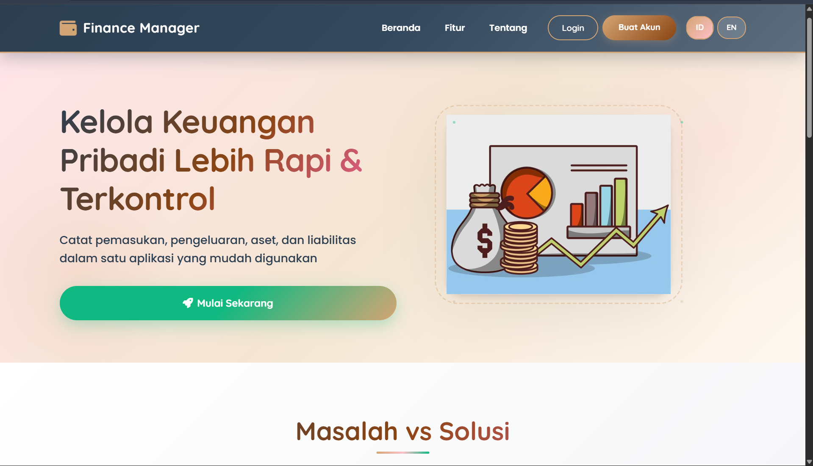
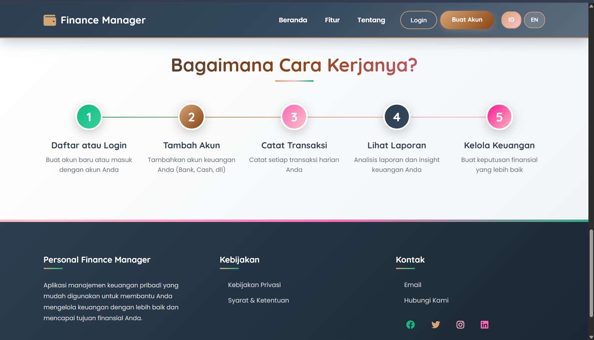
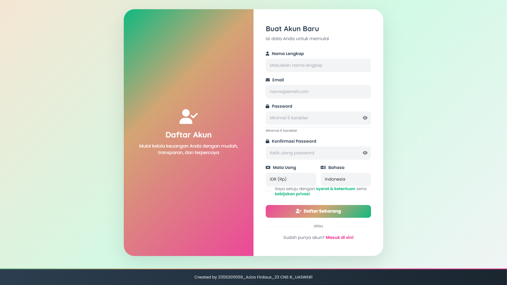
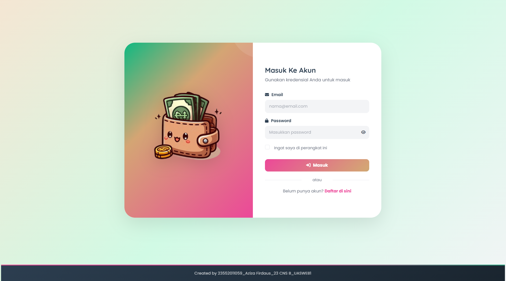
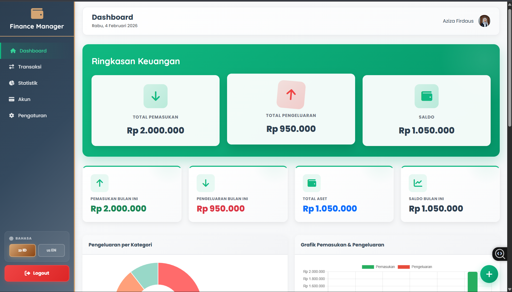
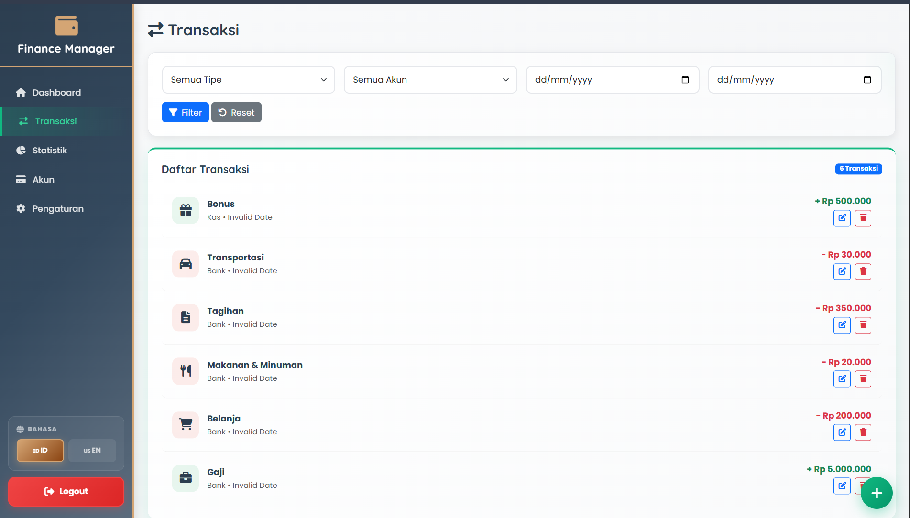
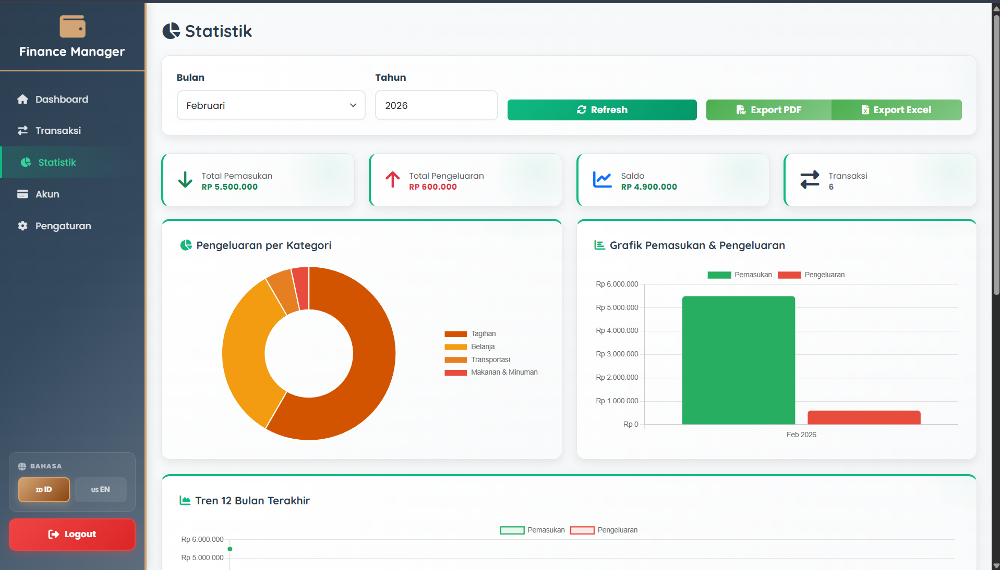
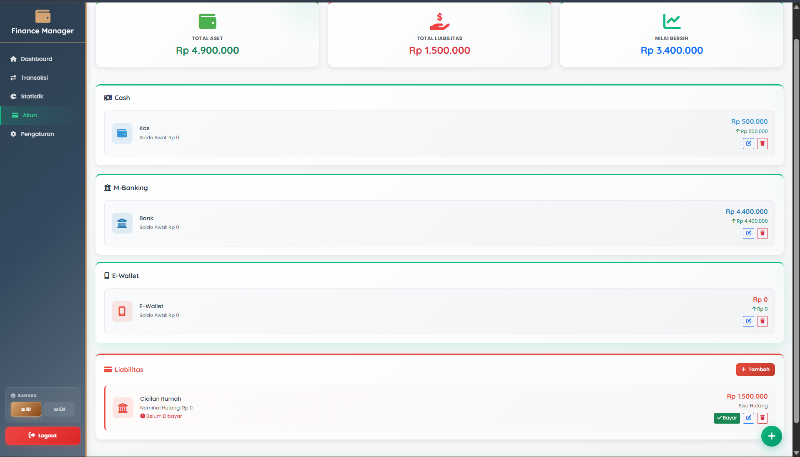
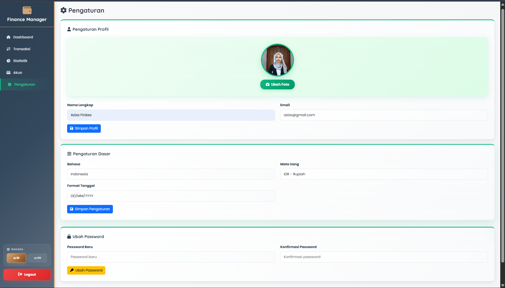

<h1 align="center">PERSONAL FINANCE MANAGER</h1>

## TENTANG

**Personal Finance Manager** adalah sistem manajemen keuangan pribadi modern berbasis web yang dirancang untuk membantu pengguna mengelola transaksi keuangan, budget, dan membuat laporan keuangan secara efisien.

Sistem ini menyediakan:

- **Aplikasi Web** dengan landing page informatif, sistem registrasi & login, serta panel dashboard untuk pengelolaan keuangan pribadi.
- **Fitur Lengkap** untuk mencatat semua transaksi (pemasukan dan pengeluaran), mengelola anggaran, menganalisis statistik pengeluaran, serta membuat laporan keuangan dalam berbagai format.

Proyek ini bertujuan untuk mendigitalkan proses pengelolaan keuangan pribadi agar lebih mudah, terstruktur, dan terukur.

---

## FITUR UTAMA

### 🏠 Halaman Publik

- **Landing Page** - Informasi lengkap tentang aplikasi dan keuntungannya
- **Registrasi & Login** - Sistem autentikasi pengguna yang aman
- **Welcome Page** - Panduan penggunaan aplikasi untuk pengguna baru

### 📊 Dashboard & Management

- **Dashboard** - Ringkasan pendapatan, pengeluaran, dan saldo total
- **Manajemen Transaksi** - CRUD transaksi pemasukan dan pengeluaran
- **Manajemen Akun** - Kelola berbagai akun keuangan (Bank, Dompet, Kartu Kredit, dll)
- **Manajemen Kategori** - Buat dan kelola kategori pengeluaran/pemasukan
- **Manajemen Budget** - Set dan monitor anggaran untuk setiap kategori
- **Statistik & Analisis** - Visualisasi data dengan chart dan grafik
- **Laporan Keuangan** - Export laporan dalam format PDF dan Excel
- **Pengaturan Profil** - Manajemen profil dan preferensi pengguna
- **Multi-Bahasa** - Dukungan bahasa Indonesia dan Inggris

#### 🔐 Akun Demo

| Email             | Password      |
| :---------------- | :------------ |
| `user@gmail.com` | `user123` |

---

## SCREENSHOT

**Landing Page**





---

**Register**



---

**Login**



---

**Dashboard**



---

**Transaksi**



---

**Statistik**



---

**Accounts**



---

**Pengaturan**



---

## VIDEO DEMO


---

## TECH STACK

### Backend

| Komponen    | Teknologi                |
| :---------- | :----------------------- |
| Bahasa      | PHP 7.4+                 |
| Framework   | Native MVC Architecture  |
| Database    | MySQL/MariaDB            |
| Autentikasi | Session-based            |
| API         | RESTful API              |

### Frontend

| Komponen    | Teknologi                        |
| :---------- | :------------------------------- |
| Markup      | HTML5                            |
| Styling     | CSS3                             |
| JavaScript  | Vanilla JavaScript               |
| Grafik      | Chart.js                         |
| Responsive  | Mobile-friendly Design           |

---

## 📂 STRUKTUR PROJECT

```
UAS_Web1/
├── backend/                 # Backend API & Logic
│   ├── api/                # REST API endpoints
│   │   ├── accounts.php
│   │   ├── auth.php
│   │   ├── budgets.php
│   │   ├── categories.php
│   │   ├── dashboard.php
│   │   ├── reports.php
│   │   ├── statistics.php
│   │   ├── transactions.php
│   │   └── users.php
│   ├── config/             # Database configuration
│   ├── controllers/        # Business logic
│   ├── middleware/         # Authentication middleware
│   └── models/             # Data models
├── frontend/               # Frontend assets & pages
│   ├── assets/            # CSS, JS, Images
│   ├── components/        # Reusable HTML components
│   └── pages/             # HTML pages
├── uploads/               # User uploads (profiles, etc)
├── docs/                  # Dokumentasi
├── database.sql           # Database schema
├── index.html             # Entry point
└── README.md              # Documentation
```

---

## 🔧 INSTALATION

### Prasyarat

- PHP 7.4 atau lebih tinggi
- MySQL/MariaDB 5.7 atau lebih tinggi
- Web Server (Apache, Nginx, atau LiteSpeed)
- Composer (opsional, untuk dependency management)

### Local Development

```bash
# 1. Clone repository
git clone https://github.com/AzizaFirda/UAS_Web1.git
cd UAS_Web1

# 2. Setup database
mysql -u root -p < database.sql

# 3. Configure database connection
cp backend/config/database.example.php backend/config/database.php
# Edit backend/config/database.php dengan kredensial MySQL Anda

# 4. Setup folder permissions
chmod 755 uploads/
chmod 755 uploads/profile/
chmod 755 uploads/profile_photos/

# 5. Jalankan dengan PHP built-in server
php -S localhost:8000

# 6. Buka di browser
# http://localhost:8000
```

### Production Deployment

Lihat [Deployment Guide](docs/DEPLOYMENT.md) untuk instruksi lengkap deployment ke production.

---

## 🚀 QUICK START

1. **Buka aplikasi** - Akses `http://localhost:8000`
2. **Register** - Buat akun baru atau gunakan akun demo
3. **Login** - Masuk ke dashboard
4. **Mulai kelola keuangan** - Tambahkan transaksi, budget, dan pantau statistik

---

## 👨‍💻 Developer

|                 |                         |
| :-------------- | :---------------------- |
| **NPM**         | 23552011059             |
| **Nama**        | Aziza Firdaus        |
| **Kelas**       | TIF RP - 23 CNS B       |
| **Mata Kuliah** | Pemrograman Web 1 (UAS) |
---
- GitHub: [@AzizaFirda](https://github.com/AzizaFirda)
- Email: azizafirdaa@gmail.com

---
<p align="center">
  Dibuat dengan ❤️ oleh Aziza Firdaus
</p>

